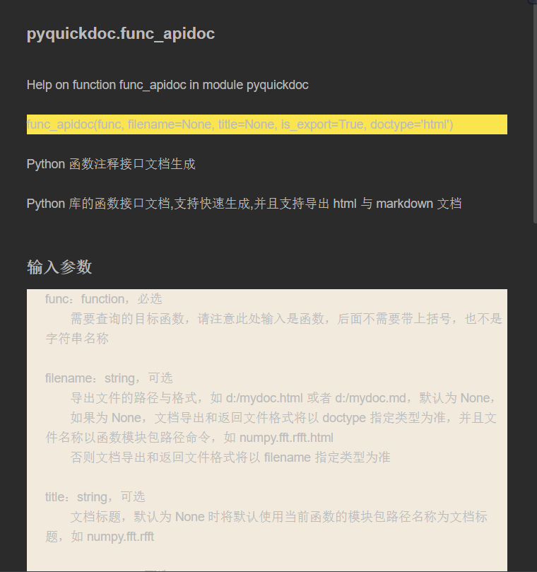
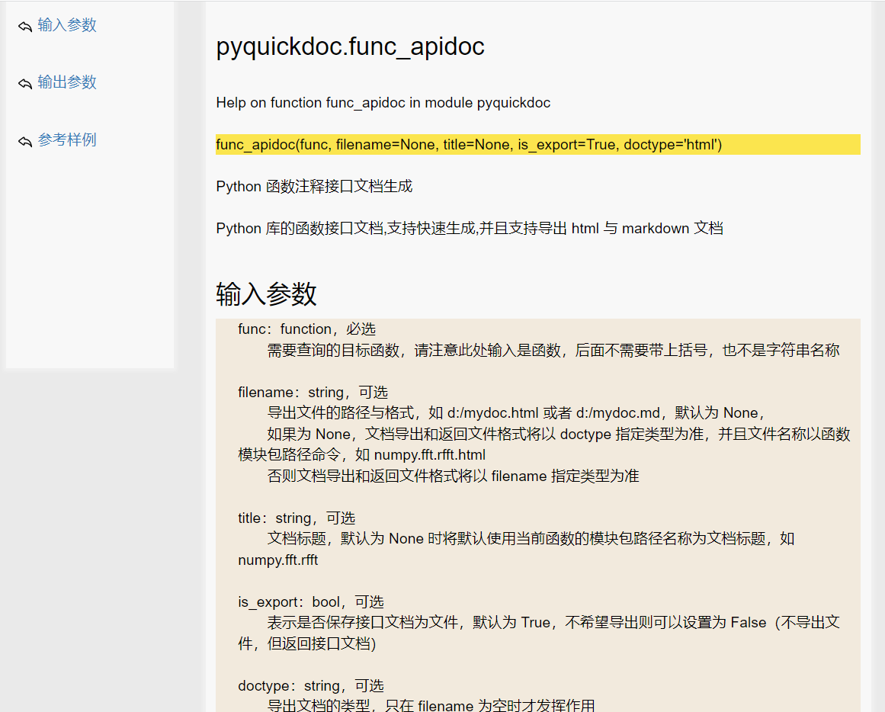
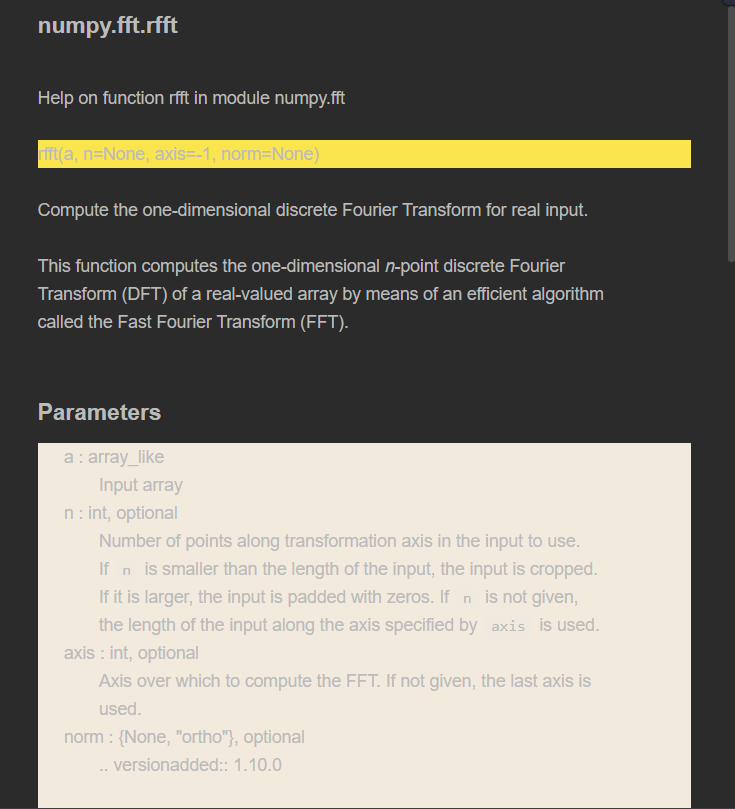
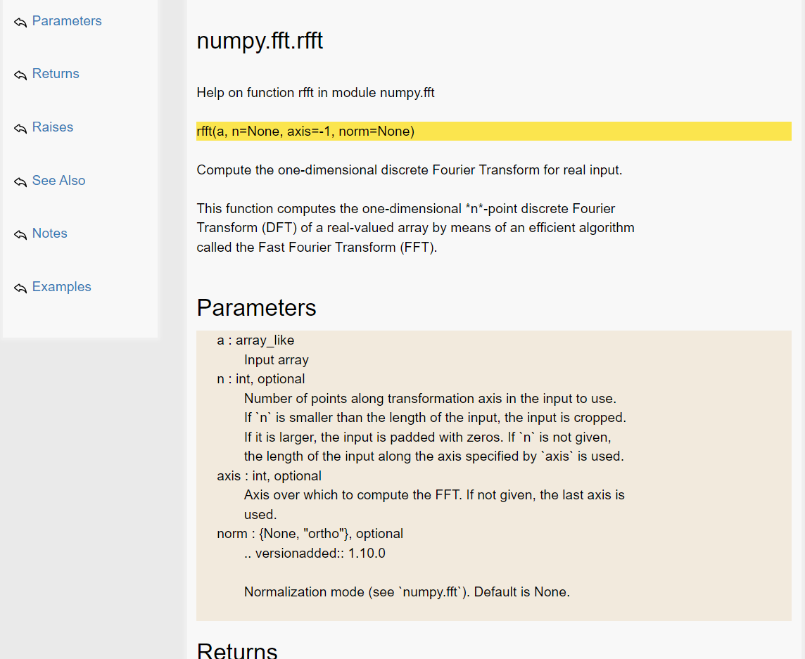
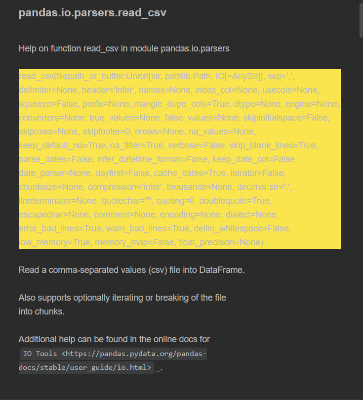
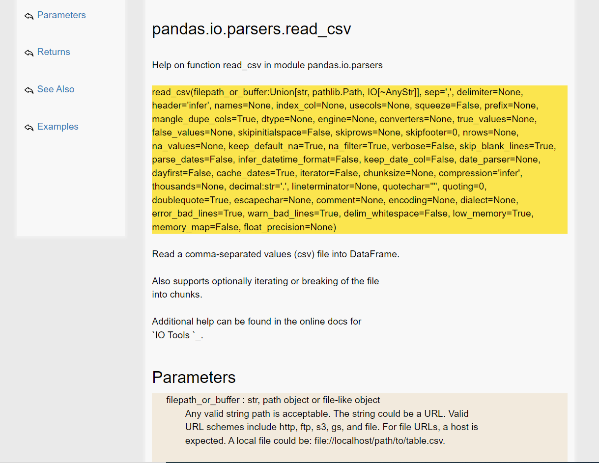

## pyquickdoc

最近再写一个开源项目，涉及到函数注释接口文档，看了网上其它自动生成接口文档的形式不太适合自己的需求，因此根据需求就写了一个能够自动生成 python 函数库的接口文档的程序，支持中文和英文函数接口获取和下载，可导出接口文档为 html 或者 markdown 格式，下面将介绍 pyquickdoc 的使用方法。


主要是为了方便查询、获取或下载python函数接口文档，觉得不错可以点个 star 支持一波。

### 下载安装
打开python环境终端，使用 `pip` 下载安装
```bash
pip install pyquickdoc
```

Collecting pyquickdoc==0.0.5
  Downloading https://pypi.tuna.tsinghua.edu.cn/packages/41/07/ad997e9887363cd4f0a2bc5b7071578492308fe21effb1aeea6212164ca0/pyquickdoc-0.0.5.tar.gz (7.9 kB)
  Preparing metadata (setup.py) ... done
Building wheels for collected packages: pyquickdoc
  Building wheel for pyquickdoc (setup.py) ... done
  Created wheel for pyquickdoc: filename=pyquickdoc-0.0.5-py3-none-any.whl size=6041 sha256=409a5113cbaf7a5c272a48412df498073c66fae020c05743fe7afe38c4a2b94a
  Stored in directory: c:\users\xxx\appdata\local\pip\cache\wheels\2b\5a\dc\bbcc8c1989ff9128cb843c2cb987e0d14525dfde45c7cc9cd9
Successfully built pyquickdoc
Installing collected packages: pyquickdoc
Successfully installed pyquickdoc-0.0.5

## 如何使用
先以本模块函数`pyquickdoc`接口文档为例、以及`numpy`与`pandas`进行介绍用法，具体效果请到`examples/`下查看

```python
if __name__ == '__main__':
    filepath = "./examples/"

    import pyquickdoc as pdoc

    # 样例 1
    pdoc.func_apidoc(pdoc.func_apidoc, filename=filepath + "pyquickdoc.func_apidoc.html")
    pdoc.func_apidoc(pdoc.func_apidoc, filename=filepath + "pyquickdoc.func_apidoc.md")
    
```
- 快速生成 pyquickdoc.func_apidoc.md 接口文档效果图



- 快速生成 pyquickdoc.func_apidoc.html 接口文档效果图


```python
if __name__ == '__main__':
    filepath = "./examples/"

    import pyquickdoc as pdoc
    import numpy as np

    # 样例 2
    pdoc.func_apidoc(np.fft.rfft, filename=filepath + "np.fft.rfft.html")
    pdoc.func_apidoc(np.fft.rfft, filename=filepath + "np.fft.rfft.md")
   
```
- 快速生成 np.fft.rfft.md 接口文档效果图

- 快速生成 np.fft.rfft.html 接口文档效果图


```python
if __name__ == '__main__':
    filepath = "./examples/"

    import pyquickdoc as pdoc
    import pandas as pd

    
    # 样例 3
    pdoc.func_apidoc(pd.read_csv, filename=filepath + "pd.read_csv.html")
    pdoc.func_apidoc(pd.read_csv, filename=filepath + "pd.read_csv.md")
```
- 快速生成 pd.read_csv.md 接口文档效果图

- 快速生成 pd.read_csv.html 接口文档效果图



